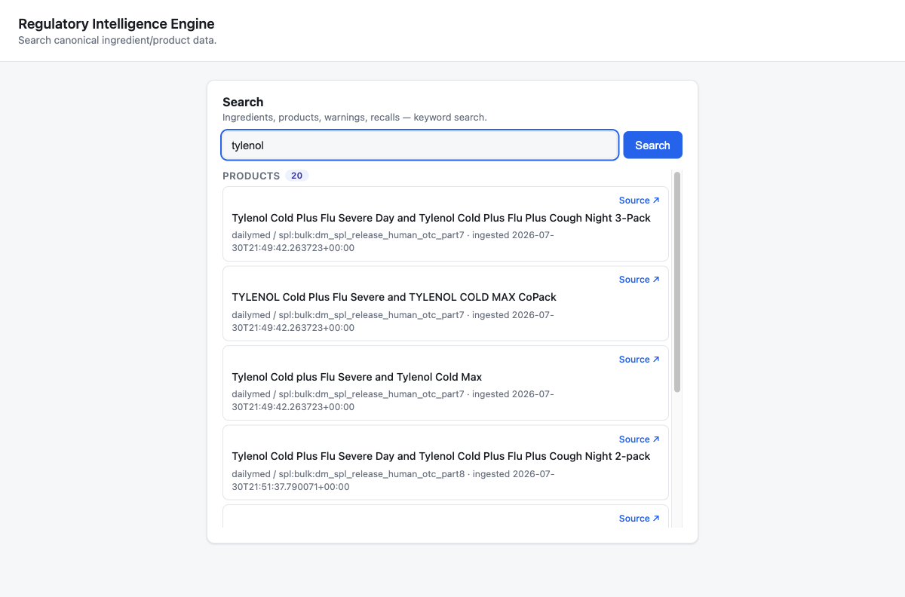
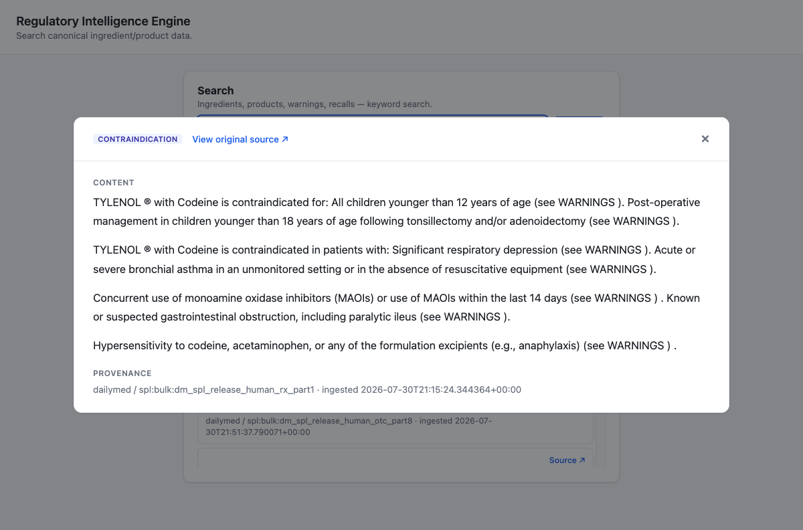
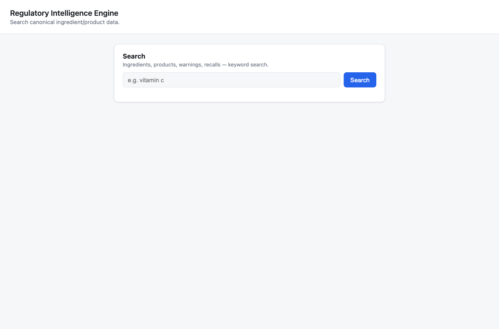

# Regulatory Intelligence Engine (RIE)

A data engine that ingests real FDA regulatory data (openFDA + DailyMed), reconciles it into one canonical, versioned, entity-resolved knowledge model, and exposes it through a search API and a citation-grounded AI layer that can't hallucinate a fact it can't point to.

**The data engine is the product, not the AI.** An LLM wrapped around messy, duplicated, unversioned government data is a liability — it hallucinates confidently and cites nothing. The actual hard problem is reconciling scattered regulatory data correctly: knowing that "Vitamin C" from one source and "Ascorbic Acid" from another are the same entity, keeping every fact traceable to its source document, and never losing that trail once an AI layer sits on top. That reconciliation is what this project is actually about.

---

## Screenshots

**Search — real data, clickable sources**



Every result — ingredient, product, warning, recall — traces back to a real source document. The "Source ↗" link isn't decorative; it opens the actual DailyMed label page for that exact record.

**Structured detail view**



Long warning text (SPL documents don't carry real paragraph breaks) gets parsed into readable, numbered points instead of one dense block.

**Empty state**



---

## What's Actually Built

Not aspirational — every item below is implemented, tested, and has been run against real government data at real scale (147,732 products, 12,981 canonical ingredients, ~3.3GB, ingested from live openFDA API pulls and DailyMed bulk exports).

- **Resumable, idempotent ingestion** for both sources — checkpointed, safe to re-run, streaming-parsed so memory stays bounded regardless of file size (verified against multi-GB DailyMed bulk exports).
- **Dead-letter queue** — a malformed record gets logged and skipped, never halts a run; per-record `SAVEPOINT` isolation so one bad record can't roll back the batch.
- **Entity resolution** across sources — authoritative-ID matching (UNII/CAS/DUNS) first, exact normalized-name match second, trigram fuzzy matching with a 3-tier confidence system (auto-merge / queue-for-review / no-match) last. Deliberately does *not* fuzzy-match "Vitamin C" to "Ascorbic Acid" on string similarity alone (confirmed `similarity() = 0.0` — real chemical synonymy needs a real synonym table, not a distance metric pretending it can guess one).
- **Full versioning** — nothing overwrites in place. Every accepted change creates a new version; retracted/superseded records stay queryable but don't surface in default search.
- **Full-text search** — PostgreSQL `tsvector`/GIN, `ts_rank`-scored, across ingredients, products, warnings, and recalls, each carrying full provenance.
- **AI layer with real tool-calling** — the model gets one bounded, read-only `search_evidence` tool and decides its own search queries, reformulating and retrying if a search comes back empty (so a bare product name typed into the ask box still works, not just a well-phrased question). Every claim in the final answer is programmatically checked against the evidence it cites; an answer with an uncited or fabricated claim never reaches the user — it's replaced with an explicit "no evidence found," never shown as-is.
- **Real citations, not citation numbers that go nowhere** — every reference resolves to a live DailyMed URL for the actual source label.
- **Operational read views** — per-source health, day-by-day trend, and entity-resolution backlog, built only from the tables that already exist (no shadow analytics store).

Also documented, not hidden: real, known limitations — phase-1 keyword search has no cross-document rarity weighting (a common word can outrank a rare, correct match; semantic/vector retrieval is the planned real fix, not a patch); a few resolution-strategy metrics aren't derivable from the current schema without further instrumentation. See [`docs/ROADMAP.md`](docs/ROADMAP.md)'s deferred-work table.

---

## Architecture

```
openFDA (REST API + bulk export)  ─┐
                                    ├─▶  Validate → Transform → Entity Resolution → PostgreSQL
DailyMed (SPL XML, bulk export)   ─┘         (canonical model: Ingredient, Product,
                                               Warning, Recall, Manufacturer, versioned)
                                                        │
                                                        ▼
                                          Full-text Search API (FastAPI)
                                                        │
                                                        ▼
                                    AI layer (tool-calling retrieval + citation
                                       verification) ── never bypasses the API,
                                       never touches raw source payloads
                                                        │
                                                        ▼
                                        Minimal static UI (search + detail view)
```

Organized by engineering layer, not by feature — a single canonical `Recall` entity is populated by multiple sources and consumed by multiple endpoints, so there's no single "feature folder" that owns it:

```
ingestion/       # One subpackage per source (openfda/, dailymed/), shared retry/checkpoint logic in common/
normalization/   # Pure string/unit normalization -- no DB access, no network
resolution/      # Entity resolution + deduplication engine
database/        # SQLAlchemy models, Alembic migrations, the query layer
api/              # FastAPI app -- thin, composes database/search queries into HTTP responses
ai/               # The only directory allowed to call an LLM. Retrieval, prompting, tool-calling, citation verification
frontend/         # Single static HTML/CSS/JS page, no build step, no framework
scripts/          # Bulk data download, ingestion runner, JSON schema inspector
tests/            # unit/, integration/ (real Postgres via docker, never mocked), golden/ (parser fixtures)
docs/             # Full engineering doc set -- design rationale for every decision below
```

`docs/` has the long-form reasoning behind every non-obvious decision: why RAG and not fine-tuning ([`AI_PIPELINE.md`](docs/AI_PIPELINE.md)), why bulk downloads *and* the live API both exist ([`OPENFDA_INGESTION.md`](docs/OPENFDA_INGESTION.md)), why entity resolution needs three separate strategies ([`ENTITY_RESOLUTION.md`](docs/ENTITY_RESOLUTION.md)), and the full 17-brick build history ([`ROADMAP.md`](docs/ROADMAP.md)).

---

## Tech Stack

| Layer | Choice |
|---|---|
| Language | Python 3.11 |
| API | FastAPI |
| Database | PostgreSQL 16 (full-text search via `tsvector`/GIN, no separate search engine yet) |
| ORM / migrations | SQLAlchemy 2.0 + Alembic |
| AI | OpenAI (`gpt-4o-mini` by default), tool-calling, no framework (no LangChain/LangGraph) |
| Frontend | Vanilla HTML/CSS/JS, zero build step |
| Package management | [uv](https://docs.astral.sh/uv/) |
| Quality gates | `ruff` (lint + format), `mypy --strict`, `pytest` against a real dockerized Postgres |
| Containerization | Docker + Docker Compose |

---

## Getting Started

Prerequisites: Docker, Docker Compose, [uv](https://docs.astral.sh/uv/).

```bash
git clone https://github.com/Himanshu507/ingredient-lens.git
cd ingredient-lens
cp .env.example .env   # fill in OPENAI_API_KEY (only needed for the AI layer)
```

**1. Bring up Postgres and the schema:**

```bash
docker compose up -d db
uv run alembic upgrade head
```

**2. Get real data.** Nothing is seeded by default — see [`docs/openfda_downloads.md`](docs/openfda_downloads.md) and [`docs/dailymed_download.md`](docs/dailymed_download.md) for exactly which files to pull and why, or download automatically:

```bash
uv run python scripts/download_bulk_data.py --dry-run   # see what would be downloaded first
uv run python scripts/download_bulk_data.py               # resumable, safe to re-run if interrupted
```

**3. Ingest it:**

```bash
uv run python scripts/run_ingestion.py --dry-run   # list what would be processed
uv run python scripts/run_ingestion.py             # openFDA first, then DailyMed; progress bar per file
```

**4. Run the app:**

```bash
docker compose up --build
```

Visit `http://localhost:8000/ui/` for the search UI, or hit the API directly (`GET /ingredients?q=acetaminophen`, `POST /ask` for the AI layer — see below).

**Local (non-Docker) development:**

```bash
uv sync
uv run pre-commit install
make lint typecheck test
```

---

## The AI Layer — Currently Disabled in the UI, Not in the Code

The `POST /ask` endpoint and the entire `ai/` package (retrieval, tool-calling, citation verification) are fully implemented, tested, and working — verified against real data with a real LLM. The "Ask a question" panel is hidden in the current frontend by default (`hidden` attribute on `#ask-section` in `frontend/index.html`) while this project's focus is search — remove that attribute to bring it back; nothing else changes.

```bash
curl -X POST localhost:8000/ask -H "Content-Type: application/json" \
  -d '{"question": "What liver warnings does acetaminophen have?"}'
```

---

## Testing

```bash
docker compose up -d db
uv run alembic upgrade head
uv run pytest              # unit + integration, against a real Postgres, never mocked
uv run ruff check .
uv run mypy .
```

**Known gap:** a subset of integration tests assert exact row counts (e.g. "exactly 2 ingredients exist after this resolution"). Those assertions only hold against an empty database. Run against this repo's own database after it's been through real bulk ingestion (147k+ products already committed), and ~20 of them fail — not because the code is broken, but because the fixtures were written assuming a pristine table and never updated to assert *count increased by N* instead of *count equals N*. Run the suite against a fresh, empty database (a second Postgres instance, or `docker compose down -v && docker compose up -d db && uv run alembic upgrade head` before ingesting anything) and all of them pass. Fixing the assertions themselves to be delta-based is on the roadmap, not yet done.

---

## What This Demonstrates

Data engineering and ETL pipeline design; resumable, idempotent ingestion against real, uncooperative government sources; entity resolution and deduplication; PostgreSQL schema/versioning design; retrieval-grounded AI that treats hallucination prevention as an architectural property, not a prompt instruction; and backend/API design — all in one coherent, brick-by-brick-built codebase, not a demo stitched together in a weekend.

---

## License

MIT — see [`LICENSE`](LICENSE).
