# Database Schema

Physical PostgreSQL schema for RIE's canonical model. Full rationale lives in
[`docs/DATABASE_DESIGN.md`](../docs/DATABASE_DESIGN.md) and
[`docs/CANONICAL_MODEL.md`](../docs/CANONICAL_MODEL.md) — this file is the
at-a-glance map plus the two things you need to *not* misread the diagram:
the versioning pattern and the polymorphic tables.

## Diagram

```mermaid
erDiagram
    INGREDIENTS ||--o{ INGREDIENT_VERSIONS : "versions (ingredient_id)"
    INGREDIENTS |o--|| INGREDIENT_VERSIONS : "current_version_id"
    MANUFACTURERS ||--o{ MANUFACTURER_VERSIONS : "versions (manufacturer_id)"
    MANUFACTURERS |o--|| MANUFACTURER_VERSIONS : "current_version_id"
    PRODUCTS ||--o{ PRODUCT_VERSIONS : "versions (product_id)"
    PRODUCTS |o--|| PRODUCT_VERSIONS : "current_version_id"

    PRODUCT_VERSIONS }o--o| MANUFACTURERS : "manufacturer_id"
    PRODUCT_VERSIONS ||--o{ PRODUCT_INGREDIENTS : "product_version_id"
    INGREDIENTS ||--o{ PRODUCT_INGREDIENTS : "ingredient_id"

    PRODUCTS ||--o{ WARNINGS : "product_id"
    PRODUCTS ||--o{ RECALLS : "product_id"
    MANUFACTURERS ||--o{ RECALLS : "manufacturer_id"

    SOURCES ||--o{ INGREDIENT_VERSIONS : "source_id"
    SOURCES ||--o{ MANUFACTURER_VERSIONS : "source_id"
    SOURCES ||--o{ PRODUCT_VERSIONS : "source_id"
    SOURCES ||--o{ WARNINGS : "source_id"
    SOURCES ||--o{ RECALLS : "source_id"
    SOURCES ||--o{ ALIASES : "source_id (nullable)"
    SOURCES ||--o{ REFERENCES : "source_id"

    INGREDIENTS {
        string id PK "ING-000123"
        int current_version_id FK
        timestamp created_at
    }
    INGREDIENT_VERSIONS {
        int id PK
        string ingredient_id FK
        int version_number
        string name
        string normalized_name
        string status "active/retracted/superseded/withdrawn"
        int source_id FK
        timestamp created_at
    }

    MANUFACTURERS {
        string id PK "MFR-000123"
        int current_version_id FK
        timestamp created_at
    }
    MANUFACTURER_VERSIONS {
        int id PK
        string manufacturer_id FK
        int version_number
        string name
        string normalized_name
        string status
        int source_id FK
        timestamp created_at
    }

    PRODUCTS {
        string id PK "PRD-000123"
        int current_version_id FK
        timestamp created_at
    }
    PRODUCT_VERSIONS {
        int id PK
        string product_id FK
        int version_number
        string name
        string product_type
        string dosage_form
        string manufacturer_id FK
        string status
        int source_id FK
        timestamp created_at
    }
    PRODUCT_INGREDIENTS {
        int product_version_id PK
        string ingredient_id PK
        string role "active/inactive"
        numeric quantity
        string unit
    }

    WARNINGS {
        int id PK
        string product_id FK
        string category "boxed_warning/contraindication/precaution"
        text text
        string status
        int version_number
        int source_id FK
        timestamp created_at
    }

    RECALLS {
        int id PK
        string product_id FK
        string manufacturer_id FK
        text reason
        string classification "class_i/ii/iii/unclassified"
        string status "ongoing/completed/terminated"
        int source_id FK
        timestamp initiated_at
        timestamp terminated_at
    }

    ALIASES {
        int id PK
        string entity_type "ingredient/manufacturer/product"
        string entity_id "polymorphic, not a real FK"
        string alias_text
        string normalized_alias_text
        numeric confidence
        int source_id FK
    }

    REFERENCES {
        int id PK
        string entity_type "ingredient/manufacturer/product"
        string entity_id "polymorphic, not a real FK"
        string reference_type "cas/unii/ndc/spl_set_id/..."
        string reference_value
        int source_id FK
    }

    SOURCES {
        int id PK
        string source_system
        string endpoint_or_document_type
        string ingestion_run_id
        string raw_payload_ref
        timestamp ingested_at
    }

    INGESTION_LOGS {
        int id PK
        string source
        string run_id
        string status
        jsonb checkpoint_state
        int records_fetched
        int records_created
        timestamp started_at
        timestamp completed_at
    }

    ENTITY_RESOLUTION_REVIEWS {
        int id PK
        string entity_type
        string candidate_a_id
        string candidate_b_id
        numeric confidence_score
        string status "pending/approved/rejected"
    }
```

## The two things this diagram can't tell you by itself

**1. Every canonical entity is two tables, not one.** `ingredients` (and
`manufacturers`, `products`) is a stable *identity* row that never changes.
`ingredient_versions` is an append-only log of every fact ever recorded about
that ingredient. "Current state" = identity row joined to
`current_version_id` (cheap indexed lookup). "Full history" = every version
row for that identity, ordered by `version_number`. **Nothing is ever
updated in place or hard-deleted** — a correction or retraction is a new
version row with a different `status`. See
[`DATABASE_DESIGN.md` §2–3](../docs/DATABASE_DESIGN.md#2-versioning-strategy).

**2. `aliases` and `references` aren't really connected to anything by a
foreign key.** Their `entity_id` column can point at an `ingredients.id`,
`manufacturers.id`, or `products.id` depending on `entity_type` — a
polymorphic pointer, not a database-enforced relationship. This trades FK
enforcement for not needing a separate `ingredient_aliases` /
`manufacturer_aliases` / ... table per entity type. See
[`DATABASE_DESIGN.md` §4](../docs/DATABASE_DESIGN.md#4-core-tables-conceptual-schema).

## Where the code lives

| Concern | Path |
|---|---|
| SQLAlchemy models | `database/models/` (one file per entity, mirrors this diagram) |
| Migrations | `database/migrations/versions/` (Alembic) |
| Typed access layer | `database/access/` — `VersionedEntityRepository` implements the identity/version mechanic once, shared by ingredients/manufacturers/products (see `versioned_repository.py`) |

To regenerate or extend this diagram: edit the Mermaid block above directly —
it renders natively on GitHub, no separate tool needed.
