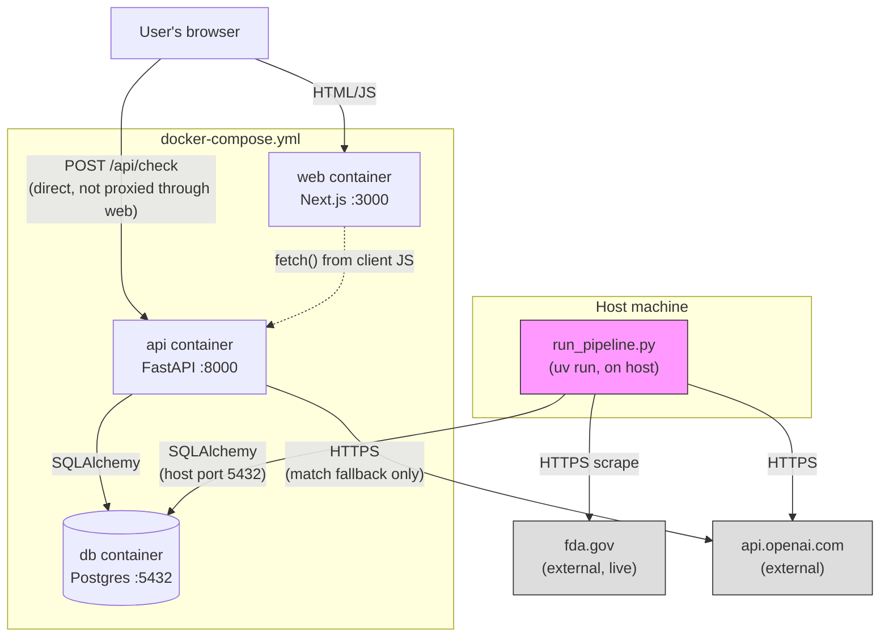
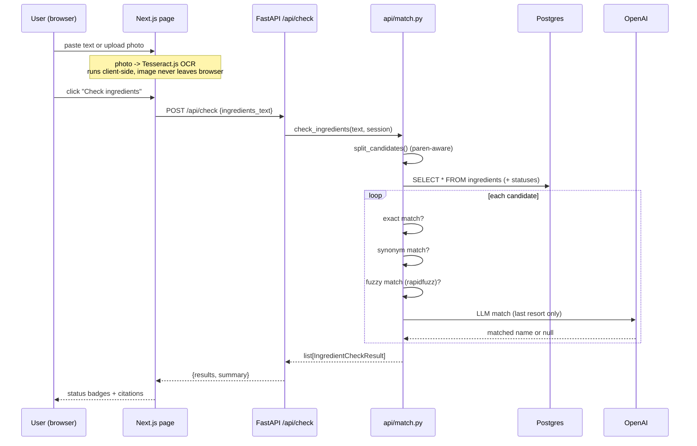

# Architecture Overview

ingredient-lens has two independent halves that only meet at the Postgres
database:

- **Part A — Reference pipeline** (`pipeline/`, `run_pipeline.py`): an offline,
  manually-triggered batch job. Scrapes one FDA page, normalizes it with an
  LLM, loads it into Postgres. Runs on the host, not in a container.
- **Part B — Product checker app** (`api/`, `web/`): an always-on web app.
  User pastes/photographs an ingredient list, backend looks each ingredient
  up against the table Part A built, returns a regulatory-status verdict.

They never call each other directly. The pipeline writes to Postgres; the API
reads from it. This is deliberate — the reference data is not something to
regenerate on every request, and the batch job (network scraping, LLM calls,
~1 minute for ~90 rows) has no place in a request/response cycle.

## Container topology

Key point: the browser calls the API **directly** at `localhost:8000`, not
through the Next.js server. `web/lib/api.ts` hardcodes/env-configures the API
origin and does a plain client-side `fetch()`. Next.js here is a static-ish
single-page app, not a BFF/proxy layer.

## Request lifecycle (the one path that matters)

## Why two separate LLM call sites

There are **two** distinct places OpenAI gets called, for different reasons —
don't conflate them:

1. **`pipeline/normalize.py` (Stage 3, offline)** — classifies each of the
   ~90 FDA rows into one of 7 `normalized_status` values, grounded only in
   the category legend + agency action text. Cached in `extraction_staging`
   keyed by content hash, so re-running the pipeline doesn't re-pay for
   unchanged rows.
2. **`api/match.py` (`_llm_match`, online, last resort)** — never invents a
   regulatory verdict. It only picks the closest *known* ingredient name from
   the list already in the DB, for candidates that survive exact/synonym/
   fuzzy matching. If OpenAI is down or errors, this tier degrades to "no
   match" (`not_in_database`) instead of crashing the request — see
   `api/match.py::_llm_match`'s `try/except`.

FDA itself is the **only** source of regulatory truth here. Neither LLM call
is allowed to assert that an unlisted ingredient has some FDA status it
doesn't — see `docs/01-pipeline.md` and `docs/03-api.md` for why.

## Tech stack at a glance

| Layer | Choice | Where |
|---|---|---|
| Pipeline / API language | Python 3.11, `uv` | root `pyproject.toml` |
| Web framework (backend) | FastAPI | `api/` |
| ORM / migrations | SQLAlchemy + Alembic | `db/` |
| Database | Postgres 16 (Docker) | `docker-compose.yml` |
| LLM | OpenAI `gpt-4o-mini` | `pipeline/normalize.py`, `api/match.py` |
| Fuzzy matching | rapidfuzz | `api/match.py` |
| Frontend framework | Next.js (App Router) | `web/` |
| Frontend package manager | pnpm | `web/pnpm-lock.yaml` |
| Styling | Tailwind CSS | `web/app/globals.css` |
| Client-side OCR | Tesseract.js | `web/utils/ocr.ts` |
| Tests | pytest (backend only) | `tests/` |
| CI | GitHub Actions | `.github/workflows/ci.yml` |

See `docs/05-file-reference.md` for what every single file does.
