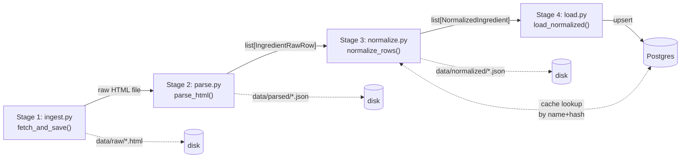

# Part A — Reference Pipeline

Offline, manually-triggered. `uv run python run_pipeline.py` on the host —
never in a container, never on a schedule. Four stages, each independently
runnable and independently testable, each writing its output to disk before
the next stage touches it (the disk artifact is the audit trail; the DB write
only happens in Stage 4).

Orchestrated by `run_pipeline.py` at the repo root — thin, just calls the four
stage functions in order and logs row counts / flagged counts at each step.

---

## Stage 1 — `pipeline/ingest.py`

**Interface:** `fetch_and_save(url=FDA_SOURCE_URL, out_dir=RAW_HTML_DIR) -> Path`

One HTTP GET to the live FDA page (`config.FDA_SOURCE_URL`), a real
`User-Agent` header, `response.raise_for_status()` so a non-200 response
raises instead of silently producing an empty downstream parse. Saves the
untouched HTML to `data/raw/fda_ingredient_directory_<date>.html` — this file
is never overwritten by re-parsing; it's the permanent record of "what FDA's
page actually said on this date."

No concurrency, no retries, no pagination — the source is a single static
`.gov` page with one table, ~90 rows.

## Stage 2 — `pipeline/parse.py`

**Interface:** `parse_html(html_path) -> list[IngredientRawRow]`, plus
`save_json(rows, out_path)`.

This is the messiest stage because the real FDA HTML is messier than the
README's original guess (which assumed ` `-separated cells — the live page
actually wraps each synonym/action in its own `
` tag). The module handles
both shapes:

- `_split_cell_into_lines()` — tries `
` children first, falls back to
  ` `-splitting, falls back to treating the whole cell as one line.
- `_parse_synonyms()` — one synonym per line, `"N/A"` dropped (never becomes
  a literal synonym string).
- `_parse_actions()` — extracts link text + `href` + a trailing
  `(Month Year)` parenthetical as `date_text`. Relative URLs
  (`/drugs/...`) get resolved to absolute `https://www.fda.gov/...` via
  `urljoin` — so `IngredientCheckResult.citation` in the API is always a
  clickable link, never a relative fragment.
- `_parse_category_codes()` — comma-separated ints, handles multi-code rows
  like `"2, 6"`.
- Malformed rows (fewer than 5 `<td>`/`<th>` cells) are logged
  (`log.warning`, with the offending row's text) and skipped — never silently
  dropped without a trace.

Output types `IngredientRawRow` / `AgencyAction` are defined *here*, not in a
separate shared-schemas file, and downstream stages import them directly from
`pipeline.parse`. This module owns "what Stage 1's HTML actually contains";
there's no value in a parallel schema file that could drift from it.

## Stage 3 — `pipeline/normalize.py`

**Interface:** `normalize_rows(rows) -> list[NormalizedIngredient]`, plus
`save_json(rows, out_path)`.

The hardest judgment call in the project (README §9.1): FDA's 7 category
codes aren't a clean traffic light, and a naive mapping would flatten very
different regulatory postures (e.g. category 1's health claim vs. category
4's "this isn't even a legal dietary ingredient") into the same bucket.

For each row:

1. **Cache check first.** `_input_hash()` hashes `{category_codes, actions}`
   (sorted JSON). Look up `ExtractionStaging` by `(ingredient_name,
   input_hash)`. Hit → reuse the cached verdict, zero LLM calls. This is what
   makes re-running the pipeline idempotent and cheap — verified: a second
   `run_pipeline.py` run against unchanged data makes **zero** OpenAI
   requests.
2. **Cache miss → call OpenAI** (`gpt-4o-mini`, via
   `client.beta.chat.completions.parse` with `response_format=
   LLMNormalizationResult` — structured output, not free-text parsing).
   `_build_prompt()` sends the full category legend text (`CATEGORY_LEGEND`,
   hardcoded from README §2, never inferred) plus the row's actual category
   codes and agency-action text, and explicitly instructs the model not to
   flatten conflicting codes — pick the most legally significant one and say
   so in the one-sentence `reasoning`.
3. **Confidence flagging.** `confidence < config.NORMALIZATION_CONFIDENCE_
   THRESHOLD` (default 0.7) → `needs_review = True`. Never silently dropped
   or silently accepted — surfaced downstream (currently: visible in the DB
   row; not yet surfaced in the app UI, see Known Gaps below).
4. Every `ExtractionStaging` row is a permanent audit record: which raw input
   produced which verdict, with what confidence, at what time. `Ingredient
   RegulatoryStatus.source_staging_id` points back to it.

`NormalizedStatus` is a closed `Literal` of exactly 7 values — the model
cannot invent an 8th status, structured-output validation rejects it.

## Stage 4 — `pipeline/load.py`

**Interface:** `load_normalized(rows) -> None`.

Upsert-by-name: for each `NormalizedIngredient`, find-or-create the
`Ingredient` row by `name`, find-or-create its `IngredientRegulatoryStatus`
row scoped to `country_id="US"`, then overwrite the mutable fields (status,
reasoning, confidence, citation, etc.) on that row. Re-running the whole
pipeline twice does **not** duplicate rows — verified directly: ingredient/
status/staging counts stay at 84/84/84 across two full runs.

`citation_url` / `citation_text` on the status row come from
`row.actions[0]` — the first agency action listed for that ingredient.

---

## What Stage 3's LLM is and isn't allowed to do

This is the load-bearing design constraint for the whole project (see also
`docs/00-overview.md`'s "why two separate LLM call sites"):

- **Allowed:** classify a *known* FDA row (category codes + actions FDA
  already published) into one of 7 fixed buckets, with reasoning grounded
  only in that text.
- **Not allowed, and not built:** invent a regulatory status for an
  ingredient FDA never ruled on. There is no live "FDA repository API" to
  query per-ingredient — the single scraped page *is* the entire source.
  Ordinary GRAS ingredients (whey protein, cocoa powder, vanilla) correctly
  never appear in this pipeline's output at all, because FDA never took
  action on them. See `docs/03-api.md` for how the app surfaces that
  distinction to the end user.

## Known gaps / not yet built

- `needs_review` rows aren't surfaced anywhere in the frontend yet — they're
  visible only via direct DB query. Every run so far has produced 0 flagged
  rows against the real page, so this hasn't been urgent, but it's a real gap
  against README's def-of-done ("low-confidence rows are visibly flagged").
- No scheduled re-scrape (deliberate — see README, project memory: manual
  trigger only, no cron/scheduler infra).
