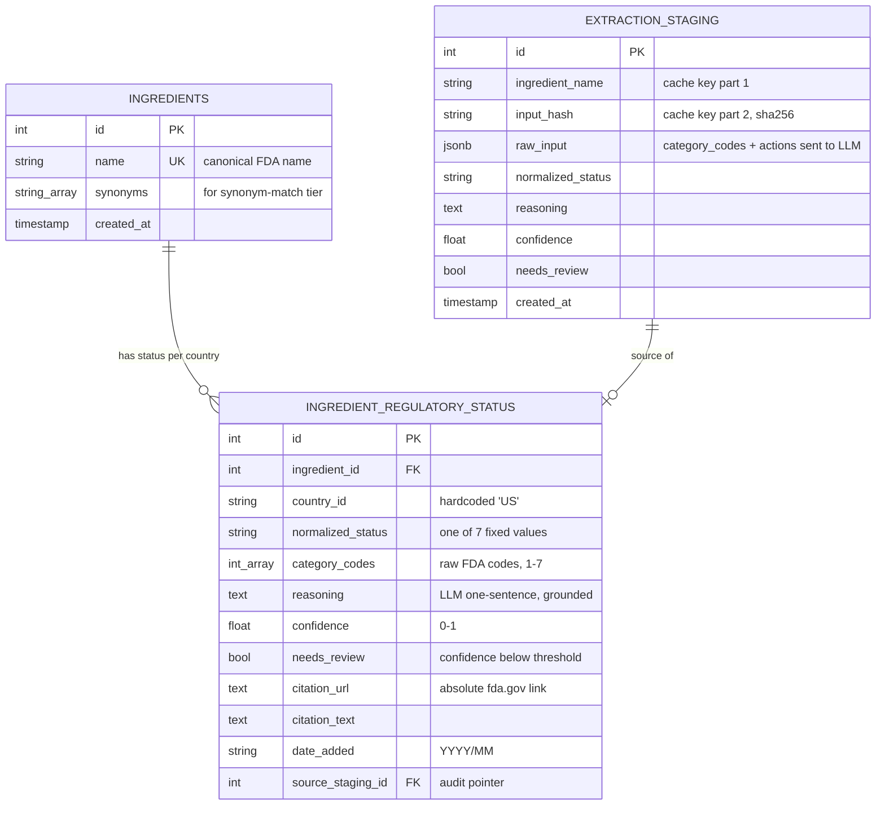

# Database

Postgres 16, running in Docker (`docker-compose.yml`, service `db`). Schema
defined once as SQLAlchemy ORM models (`db/models.py`), versioned as Alembic
migrations (`db/alembic/`). Three tables, no more — this is a ~90-row
reference table plus its audit log, not a general-purpose data warehouse.

## Entity-relationship diagram

## Table-by-table

### `ingredients`

One row per canonical FDA ingredient name. `name` is unique — this is the
upsert key Stage 4 uses (`pipeline/load.py::_upsert`), so re-running the
pipeline updates the existing row instead of creating a duplicate.
`synonyms` is a Postgres `ARRAY(String)`, checked by the API's synonym-match
tier (`api/match.py::_synonym_match`) before falling back to fuzzy matching.

### `ingredient_regulatory_status`

The actual verdict. `country_id` is hardcoded to `"US"` right now — the
column exists (rather than being folded into `ingredients`) specifically so
the shape already matches what a real multi-country schema would look like,
even though this project is single-source/single-country by design (README
non-goals). One status row per `(ingredient_id, country_id)` pair; Stage 4
finds-or-creates by that pair.

`normalized_status` is one of exactly 7 values (enforced at the Pydantic
layer in `pipeline/normalize.py`, not as a Postgres `CHECK`/enum — see
"Known gaps" below): `permitted_with_claim`, `caution_flagged`,
`not_a_dietary_ingredient`, `excluded_from_definition`,
`safety_standard_unmet`, `new_ingredient_unmet_safety`,
`premarket_notification_required`.

`category_codes` keeps the *raw* FDA codes (e.g. `[2, 6]`) even after
normalization — so the flattening judgment call (README §9.1) is always
auditable against the original source, not just trusted blindly.

### `extraction_staging`

Does double duty:

1. **Audit log** — every LLM call Stage 3 ever made, with the exact input
   that produced it.
2. **Idempotency cache** — `UniqueConstraint(ingredient_name, input_hash)`.
   Before calling OpenAI, Stage 3 looks up this exact pair; a hit means the
   underlying FDA data for that ingredient hasn't changed since last run, so
   the cached verdict is reused and zero tokens get spent. This is why a
   second `run_pipeline.py` run against unchanged source data makes zero
   OpenAI calls (verified).

`raw_input` is `JSONB` (Postgres-native, not a portable `Text`+`json.loads`
column) — chosen because we already committed to Postgres, not SQLite (see
project decision log), so there's no reason not to use the native type.

## Migrations — `db/alembic/`

Standard Alembic layout (`env.py`, `script.py.mako`, `versions/`), with one
non-standard wire: `env.py` inserts the repo root onto `sys.path` and imports
`config.DATABASE_URL` directly, overriding whatever's in `alembic.ini`
(`config.set_main_option("sqlalchemy.url", app_config.DATABASE_URL)`). This
means the same migration works unmodified whether run on the host (`
localhost:5432`) or inside the API container (`db:5432`, the compose service
name) — one less place to keep two DSNs in sync.

`target_metadata = Base.metadata` is wired to the real models, so `alembic
revision --autogenerate` produces real diffs, not empty migrations.

**Applied automatically** on API container startup — see the `CMD` in
`api/Dockerfile`: `alembic upgrade head && uvicorn ...`. Locally on the host,
you run it yourself: `uv run alembic upgrade head`.

## `db/session.py` — the only way anything touches this schema

Two entrypoints, deliberately different transaction semantics for two
different callers:

- **`get_session()`** — a context manager for scripts (the pipeline). Commits
  on clean exit, rolls back on exception, always closes. `pipeline/load.py`
  and `pipeline/normalize.py` both use this — one `with get_session():` per
  call, so a Stage 3 or Stage 4 run either fully commits or fully rolls back.
- **`get_db()`** — a generator for FastAPI's `Depends()`. Request-scoped, no
  auto-commit — `api/main.py`'s endpoint doesn't need to commit anything
  (it's read-only), so this just yields and closes.

Nobody constructs a `Session` or touches `engine` directly outside this file.

## Known gaps

- `normalized_status` is a plain `String(64)`, not a Postgres `ENUM` or a
  `CHECK` constraint — the 7-value closed set is enforced only at the
  Pydantic/application layer (`pipeline/normalize.py`'s `NormalizedStatus`
  `Literal`). A direct SQL `INSERT`/`UPDATE` bypassing the app could write an
  8th value. Acceptable for now since nothing writes to this table except
  `pipeline/load.py`, but worth a DB-level constraint if that ever changes.
- No `updated_at` column on `ingredient_regulatory_status` — you can tell
  *that* a row changed (via `extraction_staging.created_at` on its source
  staging row) but not exactly when the status row itself was last
  overwritten.
