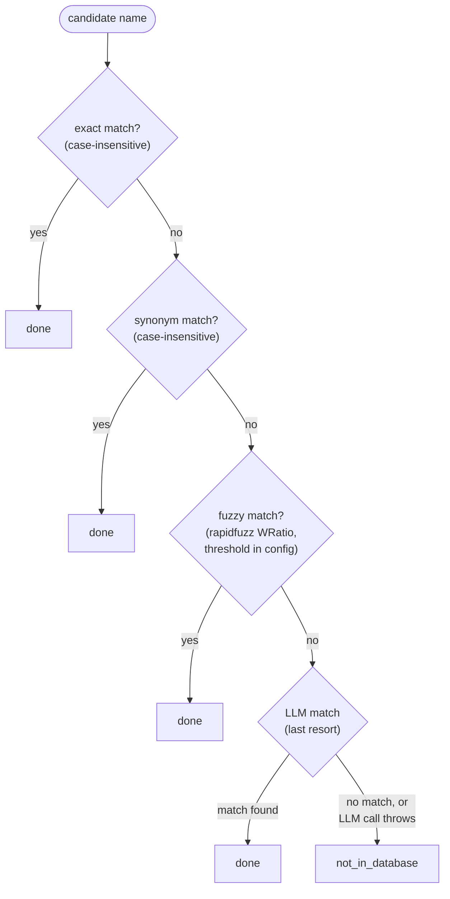

# Part B — Backend API

FastAPI, one route. Reads the table Part A built; never writes to it.
Stateless — no auth, no cookies, no session storage, nothing persisted
between requests (README non-goals).

## The one route

```
POST /api/check
  body:  { "ingredients_text": string, max 5000 chars }
  reply: { "results": IngredientCheckResult[], "summary": string }
```

`GET /` is a bare `{"status": "ok"}` health check (used by nothing in this
repo yet except manual `curl`; not currently wired into a Docker
`HEALTHCHECK`).

There is **no image upload endpoint, no vision handling, anywhere on this
backend.** Whether the text originated from typing or from client-side OCR
is invisible to the API — it only ever receives plain text. See
`docs/04-frontend.md` for where OCR actually happens (answer: entirely in
the browser).

## The matching cascade — `api/match.py`

Everything lives behind one function, `check_ingredients(text, session) ->
list[IngredientCheckResult]`. Internally, four tiers, cheapest first, each
one only tried if the previous ones missed:



- **`_exact_match`** / **`_synonym_match`** — plain case-insensitive string
  compare against `Ingredient.name` / `Ingredient.synonyms`. O(n) over the
  ~90-row table loaded once per request (`session.query(Ingredient).all()`
  in `check_ingredients`) — no per-candidate DB round-trip.
- **`_fuzzy_match`** — builds a `{name_or_synonym: Ingredient}` map, runs
  `rapidfuzz.process.extractOne` with `fuzz.WRatio`, accepts only if the
  score clears `config.FUZZY_MATCH_SCORE_THRESHOLD` (default 85). This is
  what catches OCR-style typos (`"Ephedra Sinca"` → `"Ephedra Sinica"`,
  covered in `tests/test_match.py`).
- **`_llm_match`** — genuinely last resort, and deliberately narrow: it can
  only pick one of the ingredient names *already in the DB*, never invent a
  new one. Wrapped in `try/except Exception` — an OpenAI outage or bad key
  degrades that one candidate to "no match" (`not_in_database`) rather than
  crashing the whole request. This was a real bug caught during manual
  testing (a missing `OPENAI_API_KEY` locally took down the entire `/api/
  check` response, even for candidates that had already resolved via
  exact/synonym match) — fixed, and covered by
  `tests/test_match.py::test_llm_outage_degrades_to_not_in_database_instead_of_crashing`.

### Candidate splitting — `split_candidates()`

Splits free text on commas/newlines, **except** commas inside parentheses —
`"Artificial Flavours (Chocolate, Vanilla)"` stays one entry, not two. This
was a real bug: naive comma-splitting turned that single label into
`"Artificial Flavours (Chocolate"` and `"Vanilla)"`, neither of which could
ever match anything. Depth-tracking character scan, not a regex — parens
aren't a regular language.

One known, accepted ambiguity: an ingredient name containing a bare comma
*outside* parens (e.g. a hypothetical `"1,4-dimethylamylamine"` typed without
enclosing parens) will still get split at that comma. There's no way to
distinguish "comma as list separator" from "comma as part of a chemical name"
in freeform, unstructured text — this is a genuine input-format ambiguity,
not a bug to silently paper over by guessing.

### Why "not FDA-flagged," not "unknown"

`_to_result()` returns `status: "not_in_database"` (the wire value — API
contract, don't rename this one) whenever a candidate doesn't resolve to any
ingredient, *or* resolves to an ingredient with no `US` status row. The
frontend labels this "Not FDA-flagged" rather than "Not in database" — see
`docs/04-frontend.md` — because for ordinary GRAS ingredients (whey protein,
cocoa powder, vanilla) this is the *correct and expected* answer: FDA's
source page only lists ~90 ingredients under some regulatory action, so
absence from it means "no action taken," not "data is missing."

### `build_summary()`

One-line count: `"{flagged} flagged, {clear} clear, {missing} not
FDA-flagged"`. `clear` = `permitted_with_claim`; `flagged` = any other real
status; `missing` = `not_in_database`.

## `api/models.py` — wire schemas

- `CheckRequest.ingredients_text` — `Field(..., max_length=5000)`. Enforced
  by Pydantic at the request boundary, so an oversized payload gets a 422
  before it ever reaches the matcher (covered by
  `tests/test_api.py::test_check_rejects_oversized_payload`). This is a
  defensive cap independent of the frontend's own client-side limit — never
  trust the client alone.
- `IngredientCheckResult` — one row per submitted candidate:
  `submitted_name`, `matched_ingredient` (null if unmatched),
  `status`, `reasoning`, `citation`, `confidence`.
- `CheckResponse` — `{results, summary}`.

## `api/main.py` — the wiring

Thin on purpose: CORS middleware (`allow_origins=["http://localhost:3000"]`,
POST only), the health check, and the one endpoint, which does nothing but
call `check_ingredients()` + `build_summary()` and shape the response. All
actual logic lives in `match.py` — this file has no business logic to test
independently of it.

`Depends(get_db)` — see `docs/02-database.md`'s `get_db()` — gives each
request its own SQLAlchemy session, closed after the response is built.

## Known gaps

- No rate limiting — a public deployment of this would need it (LLM fallback
  tier costs real money per unmatched candidate). Not built because this is
  a local/demo project, not a hosted service.
- `GET /` health check isn't wired into a Docker `HEALTHCHECK` directive for
  the `api` service in `docker-compose.yml` — `depends_on: condition:
  service_healthy` is only used for `db`, not `api`.
