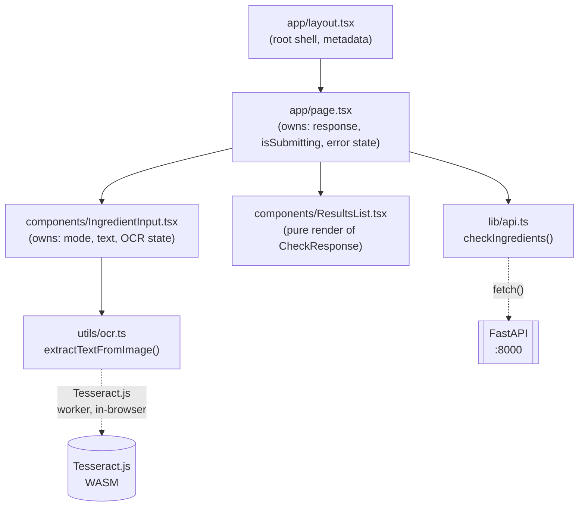
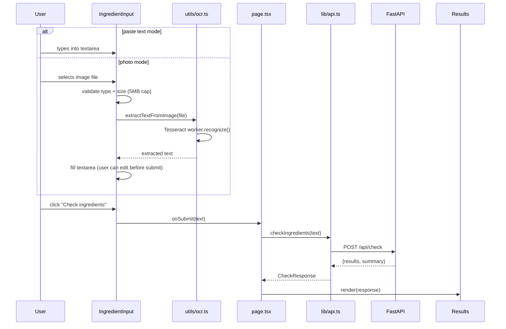

# Part B — Frontend

Next.js (App Router), single page, no router logic, no auth, no state
management library. Talks to the API directly from the browser — Next.js
here is a static single-page client, not a backend-for-frontend proxy.

## Component tree

State ownership is deliberately split: `IngredientInput` owns everything
about *getting text* (paste vs. photo, OCR progress, image validation
errors); `page.tsx` owns everything about *the request/response cycle*
(submitting, loading, error, results). `ResultsList` is a pure
render-the-props component with no state of its own.

## Data flow — one submit

Note the photo path always funnels through the *same* textarea and the
*same* `onSubmit` as the paste path — by the time text leaves
`IngredientInput`, there is no distinction between "typed" and "OCR'd." This
mirrors the backend's own invariant (`docs/03-api.md`): the API never knows
or cares where the text came from.

## File by file

### `app/layout.tsx`

Root HTML shell. Fonts (Geist Sans/Mono via `next/font/google`), page
`<title>`/description metadata, wraps `{children}` in a flex column body.
No logic.

### `app/page.tsx`

Top-level state: `response: CheckResponse | null`, `isSubmitting: boolean`,
`error: string | null`. `handleSubmit` calls `checkIngredients()`, catches
any throw into a generic "Couldn't reach the checker" message (network
failures, backend down, CORS issues all collapse to this one message — see
Known Gaps). Renders header text, `<IngredientInput>`, an error line if
present, `<ResultsList>` if a response exists.

### `components/IngredientInput.tsx`

Owns:
- `mode: "paste" | "photo"` — toggle buttons switch which controls are shown;
  the underlying `<textarea>` and submit button are shared by both modes.
- `text` — the actual editable content that will be submitted, capped
  client-side at `MAX_TEXT_LENGTH = 5000` (mirrors the backend's own
  `Field(max_length=5000)` in `api/models.py` — belt and suspenders, not
  the only guard).
- `isReadingImage` / `imageError` — photo-mode-only UI states. File
  validation happens before OCR even starts: reject non-`image/*` MIME
  types and files over `MAX_IMAGE_BYTES = 5MB` with a clear inline message,
  never a silent failure.

Submit button is disabled while submitting, while OCR is running, or while
the text box is empty — can't double-submit or submit nothing.

### `components/ResultsList.tsx`

Pure presentational. Two lookup tables map the API's wire-format `status`
strings to display text (`STATUS_LABELS`) and badge color classes
(`STATUS_COLORS`, with `DEFAULT_STATUS_COLOR` as the amber fallback for any
flagged status not explicitly listed). Renders the summary line, then one
card per result: name, badge, `reasoning` (if present), a "Source" link to
`citation` (if present — never present for `not_in_database`).

`not_in_database` displays as **"Not FDA-flagged"**, not "Not in database" —
a deliberate wording fix (see project history / `docs/03-api.md`): FDA's
source list only contains ~90 ingredients under some regulatory action, so
an ordinary ingredient's absence from it is a *good* sign, not a data gap.
The literal wire value `status: "not_in_database"` is unchanged — this is
purely a display-label fix, not an API contract change.

### `utils/ocr.ts`

One function: `extractTextFromImage(file: File): Promise<string>`. Creates a
Tesseract.js worker (`createWorker("eng")`), runs `recognize()`, always
`terminate()`s the worker in a `finally` — no leaked workers across repeated
photo uploads. This is the *only* place image bytes exist in this whole
system; they never leave the browser, never get sent in any `fetch()` call
anywhere in `lib/api.ts`.

### `lib/api.ts`

One function: `checkIngredients(text: string): Promise<CheckResponse>`.
`API_URL` reads `process.env.NEXT_PUBLIC_API_URL`, falling back to
`http://localhost:8000` — this default is what makes local dev and local
`docker-compose` both work without extra config, since the browser always
talks to the API on the *host's* exposed port regardless of whether the API
is containerized. Throws a plain `Error` on any non-2xx response; `page.tsx`
catches it.

## Known gaps

- `page.tsx`'s catch-all error message ("Couldn't reach the checker") does
  not distinguish network failure from a 4xx/5xx from the backend — a 422
  from an oversized payload and a fully-down backend look identical to the
  user. Low priority since the frontend already client-side caps text length
  to the same 5000 chars the backend enforces, but worth knowing.
- No loading skeleton/spinner beyond the submit button's own "Checking…"
  label — for a slow LLM-fallback-heavy request (many unmatched candidates),
  there's no progress indication beyond that one label staying disabled.
- OCR accuracy is untested against a real photographed label in this
  session — verified only that the mode toggle, file picker, and validation
  UI render correctly (see browser test in project history). The actual
  Tesseract.js recognition quality on a real product photo is unverified.
